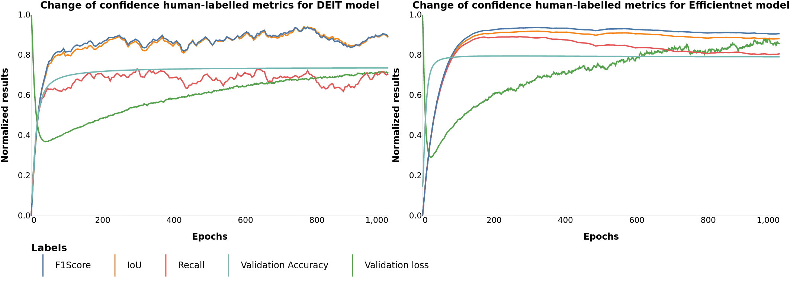
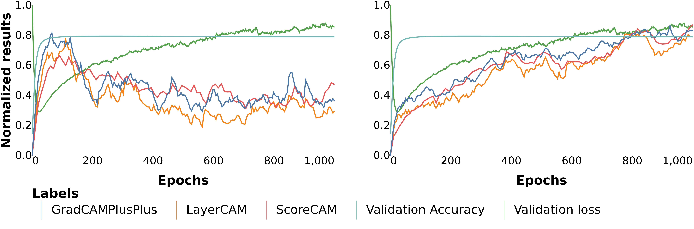

# Explainable AI

This repository contains the framework for model explainability evaluation.

The framework contains different labelled and unlabelled metrics to run on your model to evaluate its explainability and performance.
It could perform both evaluation after training and after each epoch evaluation.

In case you decide to evaluate your model during training, you will get easy to use
json file, with results for different metrics after each epoch.


## Labeled metrics
Labeled metrics could be used only if you have attention mask ground truth, as they need both prediction and target to calculate it's value.

This metrics designed to calculate similarity between human and model attention mask and could be used  to proof your model results.

#### IoUScore
Calculate IoUScore between the predicted attention map and ground truth.

This metric could also be used with ModelEvaluationCallback to calculate IoUScore after each training epoch.

 


```python
from src.metrics.metrics import MetricIoU
import torch 
correct = torch.ones((1,3,100,100))
predict = torch.rand((1,3,100,100))
metric = MetricIoU(attn_threshold=0.5)
print(metric(correct,predict))
metric = MetricIoU(attn_threshold=0.2)
print(metric(correct,predict))
```
```python
tensor(0.5070)
tensor(0.8018)
```
#### Recall
Calculate Recall between the predicted attention map and ground truth.

This metric could also be used with ModelEvaluationCallback to calculate Recall after each training epoch.

 
```python
from src.metrics.metrics import MetricRecall
import torch 
correct = torch.rand((1,3,100,100))
predict = torch.rand((1,3,100,100))
metric = MetricRecall(attn_threshold=0.5)
print(metric(correct,predict))
metric = MetricRecall(attn_threshold=0.2)
print(metric(correct,predict))
```
```python
tensor(0.4945)
tensor(0.8018)
```
#### Precision
Calculate Precision between the predicted attention map and ground truth.

This metric could also be used with ModelEvaluationCallback to calculate Precision after each training epoch.

 
```python
from src.metrics.metrics import MetricPrecision
import torch 
correct = torch.rand((3,100,100))
predict = torch.rand((3,100,100))
metric = MetricPrecision(attn_threshold=0.5)
print(metric(correct,predict))
metric = MetricPrecision(attn_threshold=0.2)
print(metric(correct,predict))
```
```python
tensor(0.4979)
tensor(0.7972)
```
#### F1Score
Calculate F1Score between the predicted attention map and ground truth.

This metric could also be used with ModelEvaluationCallback to calculate F1Score after each training epoch.

 
```python
from src.metrics.metrics import MetricF1Score
import torch 
correct = torch.rand((3,100,100))
predict = torch.rand((3,100,100))
metric = MetricF1Score(attn_threshold=0.5)
print(metric(correct,predict))
metric = MetricF1Score(attn_threshold=0.2)
print(metric(correct,predict))
```
```python
tensor(0.5037)
tensor(0.7998)
```
### MAE

#### MAE
Compute mean absolute error between the predicted attention map and ground truth.

This metric could also be used with ModelEvaluationCallback to calculate MAE after each training epoch.

 
```python
from src.metrics.metrics import MetricMAE
import torch 
correct = torch.randint(0,1,(3,100,100))
predict = torch.rand((3,100,100))
metric = MetricMAE()
print(metric(correct,predict))

```
```python
tensor(0.5012)
```

#### MAEFN
Compute mean absolute error between the predicted attention map and ground truth, but only for indexes where ground truth equal to 0.

This metric could also be used with ModelEvaluationCallback to calculate MAEFN after each training epoch.

 
```python
from src.metrics.metrics import MetricMAEFN
import torch 
correct = torch.randint(0,1,(3,100,100))
predict = torch.rand((3,100,100))
metric = MetricMAEFN()
print(metric(correct,predict))

```
```python
tensor(0.5001)
```

#### MAEFP
Compute mean absolute error between the predicted attention map and ground truth, but only for indexes where ground truth **not** equal to 0.

This metric could also be used with ModelEvaluationCallback to calculate MAEFP after each training epoch.

 
```python
from src.metrics.metrics import MetricMAEFP
import torch 
correct = torch.randint(0,1,(3,100,100))
predict = torch.rand((3,100,100))
metric = MetricMAE()
print(metric(correct,predict))

```
```python
tensor(0.4998)
```

## Unlabeled metrics
This metrics are using unlabeled data to predict model performance.

The main idea of this metrics is to calculate change of confidence after removing some percent of image.

To do this we are using **https://pypi.org/project/grad-cam/** and all unlabeled metrics and CAM algorithms are supported with ModelNoLabelCallback.

You could read more about all this metrics on **https://jacobgil.github.io/pytorch-gradcam-book/introduction.html**


## Callbacks
At the moment our framework contain three Callbacks, which could be used for after epoch evaluation.
You could easily add this Callbacks to your torch model.
### ModelEvaluationCallback
This callback evaluate model performance, which use labels to calculate scores.
Callback create json file, where results are saved as dictionary, with names of metric as key, and value as list of average
model performance on evaluation dataset on specific epoch.


To create this class you need to set few arguments:
```
explanator - pytorch-grad-cam CAM algorithm to create activation map
dataset_eval - dataset on which your model will be evaluated, it should contain
both labels and ground truth activation map.
save_file - the name for json file, where results will be saved.
metrics - Metrics, which scores will be calculated,
run_every_x(default 10) - how often do you want to run evaluate your model.
```
#### ModelEvaluationCallback use EvalRunner, which could be used for one time model evaluation.

### ModelImageSaveCallback
This callback save attention maps and image-vice metrics for eval_dataset given from explanator.

To create this class you need to set few arguments:
```
explanator - pytorch-grad-cam CAM algorithm to create activation map
dataset_eval - dataset on which your model will be evaluated, it should contain
both labels and ground truth activation map.
save_file - the name for json file, where results will be saved.
metrics - Metrics, which scores will be calculated,
run_every_x(default 10) - how often do you want to run evaluate your model.
```
#### ModelImageSaveCallback use SaveRunner, which could be used for one time model evaluation.

### NoLabelCallback
This callback calculate no label metrics for eval_dataset given from explanator.

To create this class you need to set few arguments:
```
explanator - pytorch-grad-cam CAM algorithm to create activation map
dataset_eval - dataset on which your model will be evaluated, it should contain
both labels and ground truth activation map.
save_file - the name for json file, where results will be saved.
metrics - Metrics, which scores will be calculated,
run_every_x(default 10) - how often do you want to run evaluate your model.
```
#### NoLabelCallback use LabelRunner, which could be used for one time model evaluation.

## License
For open source projects, say how it is licensed.

## Project status
If you have run out of energy or time for your project, put a note at the top of the README saying that development has slowed down or stopped completely. Someone may choose to fork your project or volunteer to step in as a maintainer or owner, allowing your project to keep going. You can also make an explicit request for maintainers.
